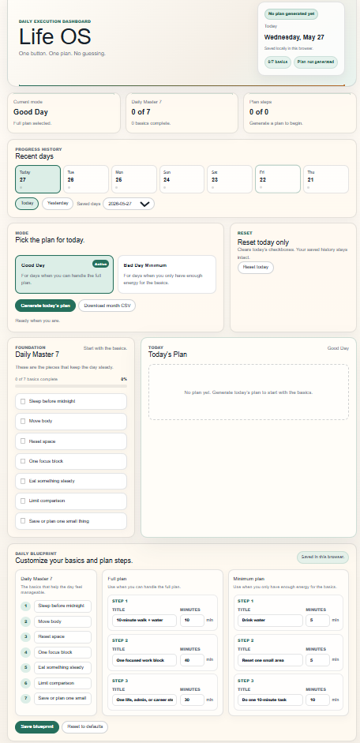
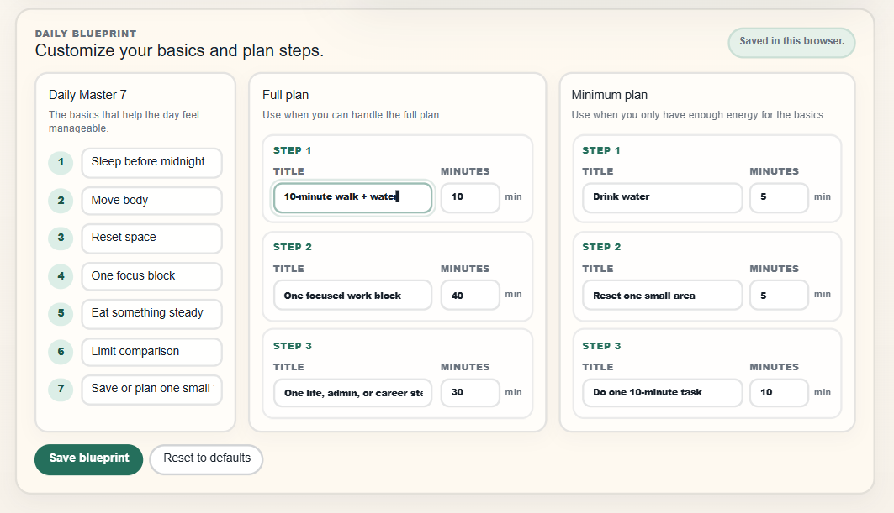
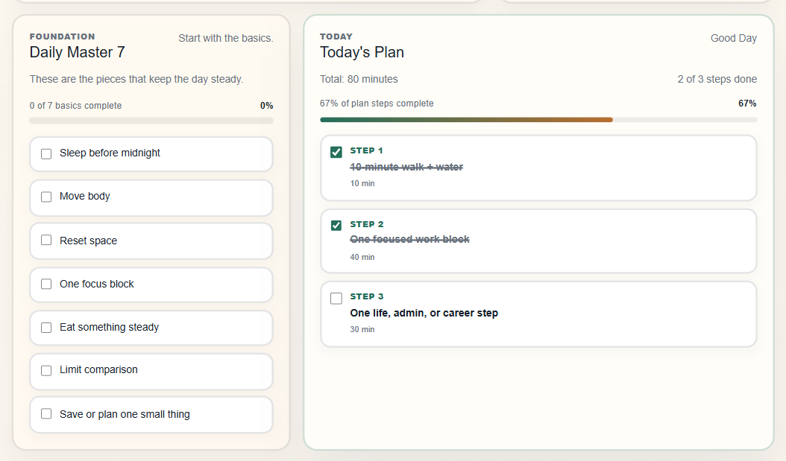
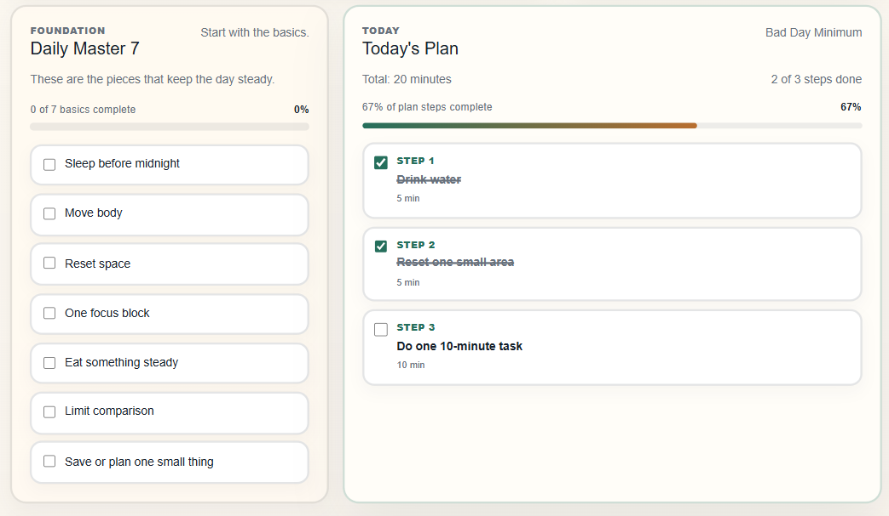
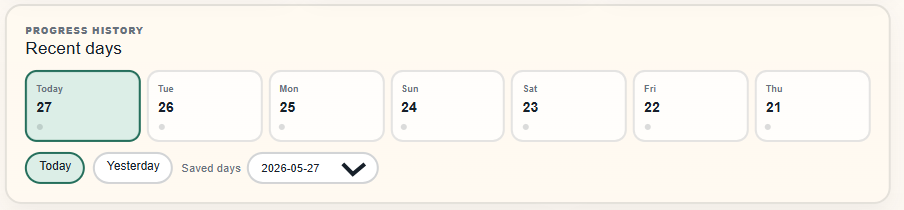
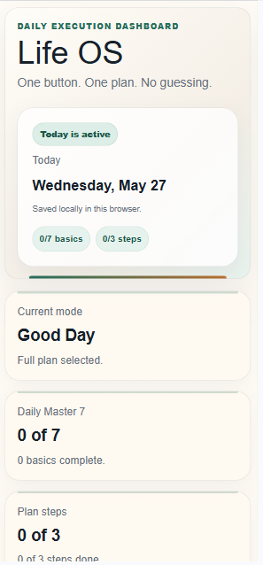

# Life OS

Life OS is a Next.js daily execution dashboard for building a customizable Good Day plan, falling back to a Bad Day Minimum plan, tracking progress locally, and exporting monthly history.

## Product Overview

Life OS is for the gap between having goals and actually knowing what to do today. It gives the user a simple plan, a smaller backup plan, and a visible record of what got done.

This is not a journal app. It is not a reflection system, memory vault, or decision guide. Ishani OS handles that kind of private self-management work. Life OS is different: it is a daily execution dashboard for choosing the right level of effort, doing the basics, following through on plan steps, and keeping a local record.

Life OS starts with a simple default blueprint, but users can edit the Daily Master 7 and plan steps so the system fits their own life instead of being locked to one routine.

Some days need the full plan. Some days just need the minimum. Life OS makes both days count.

## Why I Built It

I built Life OS because I wanted a system that worked on normal days and hard days. A lot of planning tools assume every day starts with the same energy, but that is not realistic.

Life OS gives me a full plan when I can handle it and a smaller minimum plan when I cannot. The point is not perfection. The point is having a way to keep the day from disappearing completely.

I also wanted to build a project that felt practical: a real dashboard with state, saved progress, history, reset behavior, and export logic instead of a static page.

## Current Features

### Customizable Daily Blueprint

Daily Blueprint lets the user edit the Daily Master 7 checklist, Good Day plan steps, Bad Day Minimum plan steps, and estimated minutes. The custom blueprint is saved in `localStorage`.

### Good Day Plan

Good Day mode is for full-effort days. It uses the saved blueprint to generate a longer plan with estimated minutes for each step.

### Bad Day Minimum Plan

Bad Day Minimum mode is for low-energy days. It uses the saved blueprint to keep the plan smaller so the user can still protect the basics and keep the day moving.

### Daily Master 7 Checklist

Daily Master 7 tracks the basic actions that anchor the day before anything more complicated gets added.

### Local Progress Saving

Life OS saves the custom blueprint, selected mode, checklist progress, plan step progress, selected date, and generated-plan state in `localStorage`.

### Recent History View

The dashboard includes a recent history view so the user can look back at saved days without needing an account or database.

### Read-Only Past Days

Past days are read-only so previous records stay accurate.

### Reset Today Only

The reset action clears today's checkboxes without deleting saved history.

### Monthly CSV Export

Life OS can export the current month's progress as a CSV file.

### Plan Generation API Route

The app includes a Next.js API route at `app/api/coach/route.ts` for generating the daily plan.

## How It Works

1. Choose Good Day or Bad Day Minimum.
2. Customize the Daily Blueprint if the default basics or plan steps do not fit.
3. Generate today's plan.
4. Check off Daily Master 7 basics.
5. Complete plan steps.
6. Review recent history.
7. Export monthly progress as CSV.
8. Reset today if needed without deleting history.

## Tech Stack

- Next.js
- React
- TypeScript
- CSS
- `localStorage`
- CSV export

## Screenshots

### Dashboard


### Daily Blueprint


### Good Day Plan


### Bad Day Minimum


### Progress History


### Mobile View


## Installation

Clone the repository:

```bash
git clone https://github.com/arni1596/life-os.git
cd life-os
```

Install dependencies:

```bash
npm install
```

Run the development server:

```bash
npm run dev
```

Open the app in your browser:

```text
http://localhost:3000
```

## Local Data Note

Life OS saves progress in the browser using `localStorage`. It does not use a backend database or cloud storage.

That means progress stays on the browser and device where the app is used. If browser storage is cleared, saved Life OS progress will be cleared too.

## What I Learned

This project helped me practice building a small but complete Next.js app around a real workflow.

I worked on:

- Building a Next.js app with TypeScript.
- Managing local state.
- Saving and loading progress with `localStorage`.
- Building a customizable local blueprint system.
- Creating read-only history views.
- Exporting progress to CSV.
- Designing clearer UX for different types of days.
- Writing a README that explains the project clearly.

## Future Improvements

- Blueprint templates for different seasons or routines.
- Weekly summary.
- Better mobile polish.
- Optional charts.
- Unit tests.
- Accessibility review.
- Screenshot documentation.

## Technical Highlights

- Built a Next.js and TypeScript daily dashboard with Good Day and Bad Day Minimum planning modes.
- Built a customizable local blueprint system with TypeScript state and `localStorage` so users can edit daily checklist items and plan steps without needing a backend database.
- Implemented `localStorage` persistence for daily progress, recent history, and read-only past-day views.
- Added monthly CSV export to turn daily progress into a downloadable record.
- Designed recovery-friendly UX around reset behavior, progress summaries, and low-energy planning.

## License

License information can be added later.
